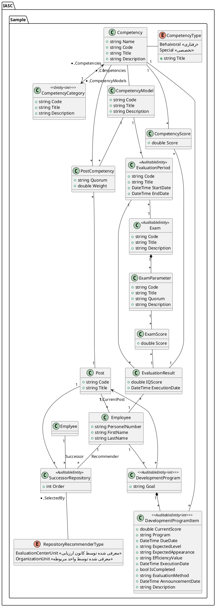

# پروژه تست

```plantuml
@startuml

namespace IASC.Sample {

enum CompetencyType {
 
  Behaivoral <<رفتاری>>
  Special <<تخصصی>>
{method}+string Title
}

class Competency{
 +string Name
}
class CompetencyCategory<<Entity<int>>>
class  CompetencyModel 
class EvaluationPeriod<<AuditableEntity>>{
 +string Code
 +string Title
 +DateTime StartDate
 +DateTime EndDate

}
class Exam <<AuditableEntity>>
class ExamParameter
class SuccessorRepository <<AuditableEntity>>
class Post
class Employee{
+string PersonelNumber
+string FirstName 
+string LastName 
}


class PostCompetency


class EvaluationResult{
+double IQScore
+DateTime ExecutionDate

}

class ExamScore{
+double Score
}

class CompetencyScore{
+double Score
}

class DevelopmentProgram<<AuditableEntity<int>>>{
+string Goal
}

class DevelopmentProgramItem<<AuditableEntity<int>>>{
+double CurrentScore
+string Program
+DateTime DueDate
+string ExpectedLevel
+string ExpectedAppearance
+string EfficiencyValue
+DateTime ExecutionDate
+bool IsCompleted
+string EvaluationMethod
+DateTime AnnouncementDate
+string Description
}

'fields 

enum RepositoryRecommenderType{
 EvaluationCenterUnit <<معرفی شده توسط کانون ارزیابی>>
 OrganizationUnit <<معرفی شده توسط واحد مربوطه>>
}

Post : +string Code
Post : +string Title


Competency : +string Code
Competency : +string Title
Competency : +string Description

CompetencyModel : +string Code
CompetencyModel : +string Title
CompetencyModel : +string Description

CompetencyCategory : +string Code
CompetencyCategory : +string Title
CompetencyCategory : +string Description

Exam : +string Code
Exam : +string Title
Exam : +string Description


ExamParameter : +string Code
ExamParameter : +string Title
ExamParameter : +string Quorum
ExamParameter : +string Description

SuccessorRepository : +int Order

PostCompetency : +string Quorum
PostCompetency : +double Weight

'Relations

Competency "*,Competencies" <--> "1" CompetencyCategory
Competency "*,Competencies" -- "*,CompetencyModels" CompetencyModel
Competency "1" -- "*" PostCompetency
Competency - CompetencyType

CompetencyModel "1" -- "*" EvaluationPeriod
CompetencyModel "1" -- "*" PostCompetency

PostCompetency "*" -- "1" Post

Post "1" -- "*" Employee
Post "1" -- "*" SuccessorRepository


SuccessorRepository  "*,SelectedBy" -- RepositoryRecommenderType 

Employee "1" -- "*" SuccessorRepository : Recommender
Emplyee "1" -- "*"  SuccessorRepository: Successor


EvaluationPeriod "*" -- "1" Exam

Exam "1" *-- "*" ExamParameter

EvaluationResult "*" -- "1" Employee
EvaluationResult "*" -- "1" EvaluationPeriod

ExamScore "*" -- "1" EvaluationResult
CompetencyScore "*" -- "1" EvaluationResult

ExamParameter "1" -- "*"  ExamScore

Competency "1" -- "*" CompetencyScore

DevelopmentProgram "1" *-- "*" DevelopmentProgramItem

Employee "1" -- "*" DevelopmentProgram

Competency "1" -- "*" DevelopmentProgramItem

Post "1,CurrentPost" <-- "*" DevelopmentProgram
}
@enduml
```
